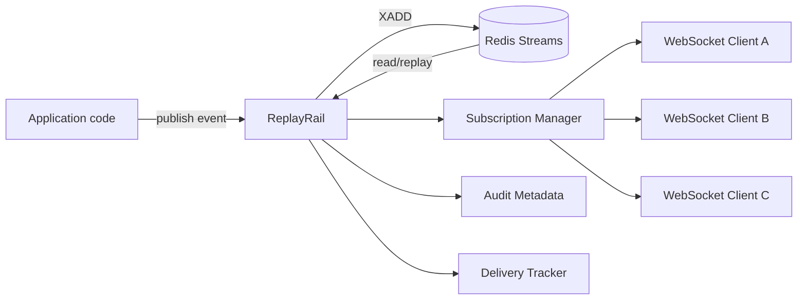

# ReplayRail

> Durable, replayable and auditable realtime events for Python WebSockets, powered by Redis Streams.

**ReplayRail** is a Python library for building realtime WebSocket systems where events are not only pushed live, but also persisted, replayable after reconnection, recoverable by cursor, and traceable for audit/debugging.

It connects **Python WebSockets** with **Redis Streams** through a higher-level event delivery layer.

```txt
WebSockets give you the live connection.
Redis Streams give you the durable log.
ReplayRail gives you replayable realtime delivery semantics between them.
```

---

## Package naming

Recommended public naming:

```txt
Repository: ReplayRail
PyPI package: replayrail
Import name: replayrail
```

Once published, installation should look like this:

```bash
pip install replayrail
```

With optional integrations:

```bash
pip install "replayrail[redis,fastapi]"
```

Python usage:

```python
from replayrail import ReplayRail
```

The package name is intentionally lowercase and simple so it works cleanly with `pip`, PyPI normalization, and Python imports.

---

## Status

ReplayRail is currently in early design/prototype stage.

The examples in this README describe the intended public API. Some names may change before the first stable release.

---

## Why ReplayRail?

A normal WebSocket connection is great for live delivery, but it does not solve what happens when a client disconnects, refreshes the browser, switches devices, or reconnects after missing events.

Redis Pub/Sub is fast, but it is transient: if a subscriber is offline, it misses the messages sent while it was disconnected.

Redis Streams gives you a durable event log, but using it directly means every application has to reimplement the same patterns:

- event envelopes;
- event IDs;
- cursors;
- replay from the last received event;
- subscriber/session management;
- WebSocket connection lifecycle;
- reconnect recovery;
- delivery acknowledgement;
- retry and recovery logic;
- audit metadata;
- retention policies;
- deduplication and idempotency.

ReplayRail exists to package those patterns into a focused library for Python realtime applications.

---

## Core idea

ReplayRail treats every realtime message as a durable event.

An event is not just sent. It is:

1. **published** to a persistent stream;
2. **assigned an event ID**;
3. **delivered** to connected WebSocket subscribers;
4. **recoverable** through cursor-based replay;
5. **traceable** through metadata;
6. **optionally acknowledged** by the client or server.

---

## Features

Planned and/or intended features:

- Redis Streams backend using `redis.asyncio`.
- FastAPI / Starlette WebSocket integration.
- Durable event publishing.
- Cursor-based replay using `last_event_id`.
- Channel-based subscriptions.
- User/session-aware subscriptions.
- Structured event envelope.
- Audit-friendly metadata.
- Correlation IDs and trace IDs.
- Reconnect recovery for missed events.
- Configurable stream retention.
- Optional delivery acknowledgements.
- Optional Redis consumer-group support.
- In-memory event store for tests.
- Pluggable `EventStore` interface for future backends.

---

## Non-goals

ReplayRail is not trying to be:

- a full replacement for Kafka, NATS JetStream, RabbitMQ, or other event brokers;
- a generic Pub/Sub abstraction over every possible transport;
- a long-term compliance archive by itself;
- a frontend state-management library;
- a complete notification product with templates, campaigns, user preferences, or billing logic.

The goal is narrower:

> Provide a durable realtime event layer for Python WebSocket applications.

---

## Architecture



Typical flow:

```txt
1. Your app publishes an event.
2. ReplayRail writes it to Redis Streams.
3. ReplayRail sends it to connected WebSocket subscribers.
4. The client stores the latest event ID it received.
5. If the client reconnects, it sends last_event_id.
6. ReplayRail replays missed events from Redis Streams.
```

---

## Installation

Once published:

```bash
pip install "replayrail[redis,fastapi]"
```

During local development:

```bash
git clone https://github.com/<your-org>/ReplayRail.git
cd ReplayRail
pip install -e ".[redis,fastapi,dev]"
```

Start Redis locally:

```bash
docker run --name replayrail-redis -p 6379:6379 redis:7
```

---

## Quick start

### 1. Create the app

```python
import redis.asyncio as redis
from fastapi import FastAPI

from replayrail import ReplayRail
from replayrail.redis import RedisStreamStore
from replayrail.fastapi import ReplayRailRouter

app = FastAPI()

redis_client = redis.from_url(
    "redis://localhost:6379",
    decode_responses=True,
)

rail = ReplayRail(
    store=RedisStreamStore(redis_client),
)

router = ReplayRailRouter(rail)
app.include_router(router)
```

---

### 2. Publish an event

```python
@app.post("/orders/{order_id}/confirm")
async def confirm_order(order_id: str):
    event_id = await rail.publish(
        channel=f"orders:{order_id}",
        event_type="order.confirmed",
        payload={
            "order_id": order_id,
            "status": "confirmed",
        },
        actor={
            "type": "user",
            "id": "usr_123",
        },
        metadata={
            "correlation_id": "req_abc123",
        },
    )

    return {"event_id": event_id}
```

---

### 3. Subscribe through WebSocket

Possible route:

```txt
/ws/{channel}?last_event_id=<redis-stream-id>
```

Browser example:

```javascript
const lastEventId = localStorage.getItem("orders:last_event_id") || "0-0";

const socket = new WebSocket(
  `ws://localhost:8000/ws/orders:ord_123?last_event_id=${lastEventId}`,
);

socket.onmessage = (message) => {
  const event = JSON.parse(message.data);

  console.log("event", event);

  localStorage.setItem("orders:last_event_id", event.id);
};
```

If the browser disconnects and reconnects later, it can pass the last event ID it received. ReplayRail can then replay missed events from Redis Streams.

---

## Event envelope

ReplayRail events should use a consistent envelope.

Example:

```json
{
  "id": "1719367320123-0",
  "channel": "orders:ord_123",
  "type": "order.confirmed",
  "payload": {
    "order_id": "ord_123",
    "status": "confirmed"
  },
  "actor": {
    "type": "user",
    "id": "usr_123"
  },
  "metadata": {
    "correlation_id": "req_abc123",
    "trace_id": "trace_456",
    "source": "orders-api"
  },
  "created_at": "2026-06-29T12:00:00Z"
}
```

Recommended fields:

| Field        | Purpose                                                |
| ------------ | ------------------------------------------------------ |
| `id`         | Redis Stream ID or library-generated event ID.         |
| `channel`    | Logical topic, room, user, tenant, or session channel. |
| `type`       | Event name, for example `order.created`.               |
| `payload`    | Application data.                                      |
| `actor`      | Who or what caused the event.                          |
| `metadata`   | Trace, correlation, source, and debugging information. |
| `created_at` | Event creation timestamp.                              |

---

## Stream naming

Default convention:

```txt
replayrail:{channel}
```

Examples:

```txt
replayrail:orders:ord_123
replayrail:user:usr_123
replayrail:tenant:acme:notifications
replayrail:system:alerts
```

For larger systems, you may want to separate logical channels from physical Redis streams:

```txt
replayrail:{tenant}:{bucket}
```

That allows many logical subscriptions without creating too many Redis keys.

---

## Why not just use `redis.asyncio` directly?

You can.

ReplayRail does not replace `redis.asyncio`; it builds a higher-level event layer on top of it.

`redis.asyncio` gives you Redis commands:

```python
await redis.xadd("events", fields)
await redis.xrange("events", min="0-0", max="+")
await redis.xread({"events": last_id})
await redis.xack("events", "group", event_id)
```

ReplayRail gives you application semantics:

```python
await rail.publish(
    channel="orders:ord_123",
    event_type="order.confirmed",
    payload={...},
)

await rail.replay(
    channel="orders:ord_123",
    after="1719367320123-0",
)
```

The point is not to hide Redis completely. The point is to centralize the rules that every realtime application otherwise has to rewrite:

- how event envelopes are shaped;
- how clients resume after disconnection;
- how cursors are handled;
- how streams are named;
- how metadata is stored;
- how delivery is acknowledged;
- how old events are trimmed;
- how WebSocket sessions are attached to channels.

---

## Is `redis.asyncio` required?

For the default Redis backend, yes.

For the core design, no.

ReplayRail should depend internally on an `EventStore` interface, not on Redis everywhere. Redis Streams can be the official default backend, while future backends can implement the same interface.

Recommended default:

```txt
Core library: replayrail
Default backend: Redis Streams
Default Redis client: redis.asyncio
Optional integrations: FastAPI / Starlette
```

Possible future backends:

- NATS JetStream;
- Kafka / Redpanda;
- PostgreSQL event table + LISTEN/NOTIFY;
- in-memory store for tests;
- custom application stores.

---

## Why not Broadcaster?

Broadcaster is useful as a generic transport abstraction. It is good when you need a simple publish/subscribe API over different backends.

ReplayRail has a different goal.

ReplayRail is focused on durable realtime event delivery, with explicit support for:

- persistent stream IDs;
- cursor-based replay;
- reconnect recovery;
- audit metadata;
- WebSocket lifecycle management;
- subscriber/session tracking;
- delivery state;
- Redis Streams as a first-class backend.

In other words:

```txt
Broadcaster = generic message transport.
ReplayRail = durable event delivery semantics for WebSockets.
```

Broadcaster can still inspire an optional adapter, but it should not be the core abstraction if ReplayRail needs strong replay, auditability and delivery control.

---

## Strict vs flexible design

ReplayRail should be strict where correctness matters and flexible where applications differ.

Strict by default:

- event envelope shape;
- event ID handling;
- cursor format;
- channel naming rules;
- JSON serialization boundaries;
- reconnect/replay behavior;
- validation of required metadata.

Flexible by configuration:

- stream naming strategy;
- retention policy;
- acknowledgement mode;
- serializer/deserializer;
- authorization checks;
- backend implementation;
- WebSocket route structure;
- tenant/channel mapping.

This gives the library a clear contract without forcing every app to use the exact same architecture.

---

## Event store abstraction

The core should depend on an internal interface, not directly on Redis everywhere.

```python
from typing import Any, Protocol

class EventStore(Protocol):
    async def publish(
        self,
        channel: str,
        event: dict[str, Any],
    ) -> str:
        ...

    async def read_after(
        self,
        channel: str,
        last_event_id: str,
        limit: int = 100,
    ) -> list[dict[str, Any]]:
        ...

    async def trim(
        self,
        channel: str,
        maxlen: int,
    ) -> None:
        ...
```

Default implementation:

```python
store = RedisStreamStore(redis_client)
rail = ReplayRail(store=store)
```

This keeps Redis Streams as the main backend while leaving room for future implementations.

---

## Configuration example

```python
from replayrail import ReplayRail, ReplayRailConfig
from replayrail.redis import RedisStreamStore

rail = ReplayRail(
    store=RedisStreamStore(redis_client),
    config=ReplayRailConfig(
        stream_prefix="replayrail",
        replay_limit=500,
        max_stream_length=10_000,
        require_ack=False,
        include_audit_metadata=True,
    ),
)
```

---

## Client acknowledgement modes

ReplayRail can support different delivery modes depending on how strict the application needs to be.

| Mode              | Description                                           | Best for                |
| ----------------- | ----------------------------------------------------- | ----------------------- |
| `fire_and_forget` | Send live events without client ACK.                  | Low-risk UI updates.    |
| `cursor_only`     | Client stores and sends `last_event_id` on reconnect. | Most realtime apps.     |
| `client_ack`      | Client explicitly confirms received events.           | Critical notifications. |
| `server_ack`      | Server acknowledges after successful WebSocket send.  | Operational tracking.   |
| `consumer_group`  | Workers use Redis consumer groups and ACK.            | Background processing.  |

Recommended default:

```txt
cursor_only
```

It gives a good balance between reliability and simplicity.

---

## Retention

Streams should not grow forever.

ReplayRail should support configurable retention policies:

```python
ReplayRailConfig(
    max_stream_length=10_000,
    trim_strategy="approximate",
)
```

Possible strategies:

| Strategy            | Meaning                                    |
| ------------------- | ------------------------------------------ |
| `none`              | Never trim automatically.                  |
| `maxlen`            | Keep approximately or exactly N events.    |
| `ttl`               | Keep events for a time window.             |
| `archive_then_trim` | Copy old events elsewhere before trimming. |

For long-term audit/compliance, Redis Streams can be the operational log, while another system such as PostgreSQL, object storage, or a data warehouse stores the long-term archive.

---

## Authorization

ReplayRail should not assume that every connected client can read every channel.

A typical integration should allow applications to provide an authorization function:

```python
async def can_subscribe(user, channel: str) -> bool:
    return channel.startswith(f"user:{user.id}")
```

Example configuration:

```python
router = ReplayRailRouter(
    rail,
    authorize=can_subscribe,
)
```

---

## Error handling

ReplayRail should expose clear errors for common failure cases:

```python
from replayrail.exceptions import (
    ReplayRailError,
    InvalidChannelError,
    InvalidCursorError,
    ReplayWindowExpiredError,
    SubscriberNotFoundError,
)
```

Example:

```python
try:
    events = await rail.replay("orders:ord_123", after=last_event_id)
except ReplayWindowExpiredError:
    # The client is too far behind.
    # The app may reload full state from the database.
    events = []
```

---

## Suggested package structure

```txt
replayrail/
├── __init__.py
├── rail.py
├── config.py
├── events.py
├── exceptions.py
├── store.py
├── redis/
│   ├── __init__.py
│   └── stream_store.py
├── fastapi/
│   ├── __init__.py
│   ├── router.py
│   └── websocket_manager.py
├── serializers/
│   ├── json.py
│   └── msgpack.py
└── testing/
    └── memory_store.py
```

---

## `pyproject.toml` example

```toml
[project]
name = "replayrail"
description = "Durable, replayable and auditable realtime events for Python WebSockets, powered by Redis Streams."
readme = "README.md"
requires-python = ">=3.11"
license = { text = "MIT" }
authors = [
  { name = "Your Name" }
]
dependencies = []

[project.optional-dependencies]
redis = [
  "redis>=5",
]
fastapi = [
  "fastapi>=0.110",
  "starlette>=0.37",
]
dev = [
  "pytest",
  "pytest-asyncio",
  "ruff",
  "mypy",
]
```

---

## Development

Install dependencies:

```bash
pip install -e ".[redis,fastapi,dev]"
```

Run tests:

```bash
pytest
```

Run formatting:

```bash
ruff check .
ruff format .
```

Run type checks:

```bash
mypy replayrail
```

---

## Example development stack

```yaml
services:
  redis:
    image: redis:7
    ports:
      - "6379:6379"
```

Start it with:

```bash
docker compose up -d
```

---

## Roadmap

### v0.1.0

- Redis Streams event store.
- Basic event envelope.
- Publish and replay API.
- FastAPI WebSocket route helper.
- Cursor-based reconnect recovery.
- In-memory store for tests.

### v0.2.0

- Client acknowledgement mode.
- Delivery tracking.
- Stream retention configuration.
- Channel authorization hooks.
- Better typing and Pydantic models.

### v0.3.0

- Consumer group support.
- Background worker helpers.
- Event archive hooks.
- Metrics and observability hooks.

### Future

- NATS JetStream backend.
- Kafka/Redpanda backend.
- PostgreSQL event table backend.
- Admin/debug dashboard.

---

## Example use cases

ReplayRail is useful for:

- order status updates;
- user notifications;
- collaborative dashboards;
- audit-visible UI events;
- multiplayer/collaborative app state updates;
- admin panels with realtime activity feeds;
- background job progress updates;
- reconnectable browser sessions;
- multi-instance FastAPI deployments.

---

## Design principle

ReplayRail should not hide the fact that Redis Streams exists.

Instead, it should make the common patterns safe, consistent and easy:

```txt
Be strict about event correctness.
Be flexible about application architecture.
Expose Redis power without leaking Redis complexity everywhere.
```

---

## Trademark note

ReplayRail is not affiliated with Redis Ltd. Redis is a trademark of Redis Ltd. The library uses Redis Streams as one of its supported backends.

---

## License

MIT License.
